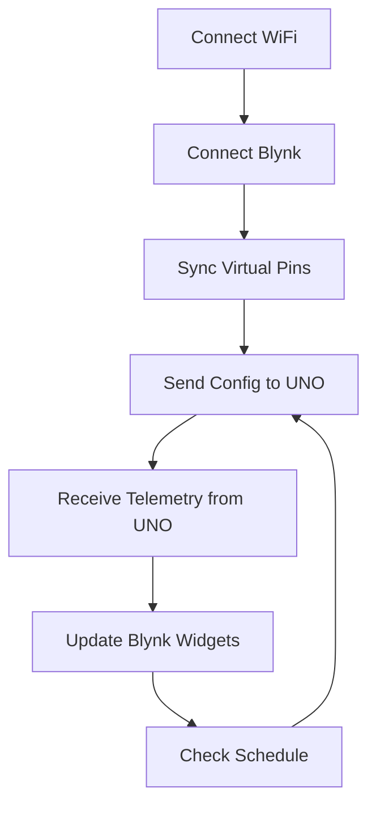

# Feederasea ESP32 (Blynk + WiFi)

Firmware ini berjalan di ESP32 38-pin. Tugasnya mengelola Blynk, WiFi, jadwal feeding, dan komunikasi serial ke UNO melalui UART RX/TX.

---

## 1) Instalasi dan Persiapan

1. Install PlatformIO (VS Code extension) atau PlatformIO Core.
2. Buka folder `D:\Elban\Fariz\Feederasea-R3Wifi-ESP8266`.
3. Isi WiFi dan token di `include/secrets.h`.
4. Build dan upload menggunakan PlatformIO:

```
platformio run
platformio run -t upload
platformio device monitor -b 9600
```

---

## 2) Daftar Komponen

- ESP32 DevKit 38-pin
- Koneksi UART RX/TX ke Arduino UNO (D0/D1)
- Level shifting untuk UNO TX (5V) ke RX ESP32 (3.3V)
- WiFi AP untuk koneksi Blynk
- Smartphone dengan Blynk app

---

## 3) Blynk Datastream dan Fungsi

### Input (dari App)
- V1  `Sim_Temp` (Double, C) -> suhu simulasi
- V2  `Biomass` (Double, g) -> total biomassa
- V3  `Manual_Feed` (0/1) -> perintah feed manual
- V4  `Mode_Select` (0..2) -> Mode A/B/C
- V5  `PWM_Percent` (0..100) -> kecepatan motor
- V6  `GramPerSec_100` (1..20) -> laju gram/detik pada PWM 100%
- V7  `Sim_Event` (0/1) -> aktifkan simulasi
- V8  `Test_In` (Double, cm) -> jarak simulasi

Catatan:
- V1 dan V8 hanya dipakai jika V7 aktif.
- V3 dan V7 sebaiknya widget button (momentary) agar tidak latch.

### Output (ke App)
- V20 `TempC` -> suhu real
- V21 `Feed_Remaining` -> estimasi pakan
- V22 `Biomass_Out` -> biomassa
- V23 `Last_Cmd_Grams` -> gram terakhir
- V24 `Last_PWM` -> PWM terakhir
- V25 `Last_Event` -> label event

---

## 4) Pengertian Mode dan Tombol

### Mode A (0)
- Komando pakan tetap 50g per event.

### Mode B (1)
- 25 C sampai 37 C: 3% dari biomassa.
- Di luar rentang: 2% dari biomassa.

### Mode C (2)
- Jadwal feeding jam 07:00 dan 17:00 (WITA).
- Rumus gram sama dengan Mode B.
- Ada guard untuk mencegah double trigger harian.

### Tombol dan Kontrol
- `Manual_Feed (V3)`: trigger feed manual.
- `Sim_Event (V7)`: aktifkan simulasi dan trigger event simulasi.
- `PWM_Percent (V5)`: kecepatan motor.
- `GramPerSec_100 (V6)`: kalibrasi laju gram/detik.
- `Sim_Temp (V1)` dan `Test_In (V8)`: hanya aktif saat V7=1.

---

## 5) Flowchart (ESP8266)



---

## 6) Cara Kalibrasi

### A) Biomassa
- Isi V2 dengan total berat ikan (gram).

### B) Laju Pakan (GramPerSec)
- Jalankan motor pada PWM 100% selama 5 detik.
- Ukur massa pakan keluar.
- Hitung gram per detik, masukkan ke V6.

### C) Uji Simulasi (Sim_Event)
- Set V7 = 1 untuk aktifkan simulasi.
- Atur V1 (Sim_Temp) dan V8 (Test_In).
- Tekan V7 lagi untuk trigger simulasi event.
- Set V7 = 0 untuk kembali ke sensor real.

---

## 7) Protokol Serial

ESP mengirim perintah ke UNO:
- `SET:MODE=0|1|2`
- `SET:BIOMASS=xxxx`
- `SET:PWM=0..100`
- `SET:GPS100=1..20`
- `SET:SIM_MODE=0|1`
- `SET:SIM_TEMP=xx.xx`
- `SET:SIM_DIST=xx.xx`
- `CMD:MANUAL`
- `CMD:SIM_EVT`
- `CMD:SCHED_07`
- `CMD:SCHED_17`

UNO mengirim telemetry ke ESP:
```
TELEM,T=xx.xx,TR=yy.yy,DIST=zz.z,FEED=nnn,MODE=m,STATE=s,EVENT=LABEL,BIOMASS=bbbb,CMD=ccc,PWM=pp,SIM=0|1
```

---

## 8) Troubleshooting

- Tidak connect WiFi: cek `include/secrets.h`.
- Tidak ada data di Blynk: pastikan UART UNO<->ESP32 terhubung dan baud 9600.
- V1/V8 tidak berpengaruh: pastikan V7 aktif.

---

## 9) Catatan Operasi

- Saat flashing ESP32, lepaskan koneksi UART ke UNO agar upload tidak terganggu.
- Saat operasi, pastikan RX/TX dan GND terhubung (UNO D0/D1 <-> ESP32 GPIO3/GPIO1).
