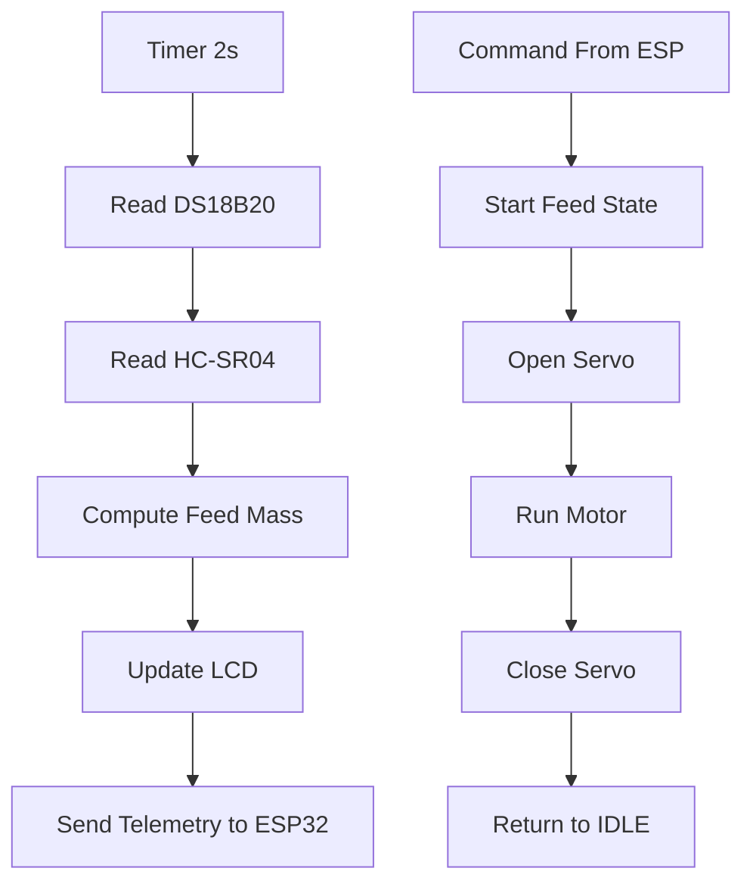

# Feederasea UNO (Sensor + Aktuator)

Firmware ini berjalan di Arduino UNO. Tugasnya membaca sensor, menghitung massa pakan, dan mengendalikan motor/servo/LCD. Komunikasi ke ESP32 melalui UART.

---

## 1) Instalasi dan Persiapan

1. Install PlatformIO (VS Code extension) atau PlatformIO Core.
2. Buka folder `D:\Elban\Fariz\Feederasea-R3Wifi-UNO`.
3. Build dan upload menggunakan PlatformIO:

```
platformio run
platformio run -t upload
platformio device monitor -b 9600
```

---

## 2) Daftar Komponen

- Board UNO R3 (terhubung ke ESP32 38-pin)
- Sensor suhu DS18B20 + resistor 4.7k pull-up
- Sensor jarak HC-SR04 + level shifter (atau divider) untuk ECHO 3.3V
- Driver motor BTS7960
- Motor DC + piringan pelontar pakan
- Servo MG996R
- LCD I2C 16x2 (alamat umum 0x27)
- Push button manual + resistor pull-up eksternal (opsional jika INPUT_PULLUP)
- LED status + resistor, LED low feed + resistor
- Power supply 12V (motor) dan 5V (UNO, servo, sensor, LCD)
- Step-down 12V ke 5V (contoh LM2596)
- Kabel, terminal, dan konektor

---

## 3) Wiring dan List GPIO (UNO)

### Wiring Inti
- DS18B20 DATA -> D4 (pull-up 4.7k ke 3.3V)
- HC-SR04 TRIG -> D12, ECHO -> D11 (level shift)
- Servo MG996R SIG -> D9
- BTS7960: LPWM D5, RPWM D6, L_EN D7, R_EN D8
- LCD I2C: SDA A4, SCL A5
- LED status D13, LED low feed D10
- Tombol manual D2 (INPUT_PULLUP, tombol ke GND)

### List GPIO
- D2  : Manual button (INPUT_PULLUP)
- D4  : DS18B20 data
- D5  : BTS7960 LPWM
- D6  : BTS7960 RPWM
- D7  : BTS7960 L_EN
- D8  : BTS7960 R_EN
- D9  : Servo MG996R signal
- D10 : LED low feed
- D11 : HC-SR04 ECHO (level-shift)
- D12 : HC-SR04 TRIG
- D13 : LED status
- A4  : I2C SDA (LCD)
- A5  : I2C SCL (LCD)
- D0  : UART RX (ke ESP32 TX0 / GPIO1)
- D1  : UART TX (ke ESP32 RX0 / GPIO3, wajib level shift 5V->3.3V)

---

## 4) Cara Kerja (Ringkas)

UNO membaca sensor setiap 2 detik, menghitung estimasi pakan, lalu menampilkan status di LCD. Saat menerima perintah feed dari ESP8266, UNO menjalankan state machine: buka servo, jalankan motor, lalu tutup servo.

---

## 5) Flowchart (UNO)



---

## 6) Kalibrasi

### A) Kalibrasi Hopper
Atur di `src/main.ino`:
- `H_TOTAL_CM` : jarak sensor ke dasar saat hopper kosong.
- `RADIUS_CM` : radius tabung hopper.
- `BULK_DENSITY_G_PER_CM3` : densitas pakan.

Langkah cepat:
1. Ukur jarak kosong -> set `H_TOTAL_CM`.
2. Isi pakan dengan massa diketahui (misal 1000g).
3. Baca nilai estimasi di serial.
4. Sesuaikan `BULK_DENSITY_G_PER_CM3` sampai mendekati massa sebenarnya.

### B) Kalibrasi Laju Pakan (Grams per second)
- Parameter `gramsPerSec100` dikirim dari ESP8266 (V6).
- Ukur berapa gram pakan keluar dalam 5 detik pada PWM 100%.
- Hitung gram per detik, isi ke V6.

---

## 7) Troubleshooting

- LCD stuck "Feeding...": pastikan tombol manual tidak floating, gunakan INPUT_PULLUP dan tombol ke GND.
- Motor tidak jalan: cek 12V, wiring BTS7960, dan ground bersama.
- Suhu tidak terbaca: cek DS18B20 dan resistor 4.7k.

---

## 8) Catatan Operasi

- Saat runtime, pastikan UART UNO<->ESP32 terhubung dan semua GND common.
- Semua ground harus common ground.
