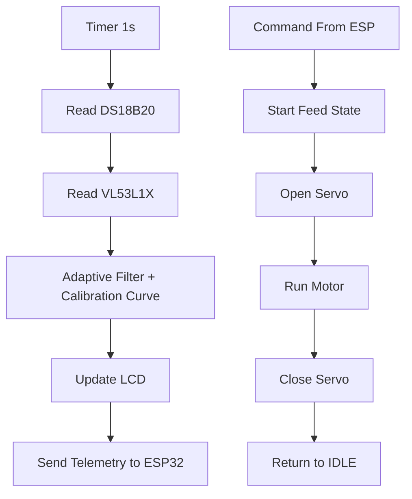

# Feederasea UNO (Sensor + Aktuator)

Firmware ini berjalan di Arduino UNO. Tugasnya membaca sensor, menghitung massa pakan, dan mengendalikan motor/servo/LCD. Komunikasi ke ESP32 melalui UART.

---

## 1) Instalasi dan Persiapan

1. Install PlatformIO (VS Code extension) atau PlatformIO Core.
2. Buka folder `D:\Elban\Fariz\Feederasea-R3Wifi-UNO`.
3. Build dan upload menggunakan PlatformIO:

```
platformio run
platformio run -t upload
platformio device monitor -b 9600
```

---

## 2) Daftar Komponen

- Board UNO R3 (terhubung ke ESP32 38-pin)
- Sensor suhu DS18B20 + resistor 4.7k pull-up
- Sensor jarak VL53L1X (ToF, I2C)
- Driver motor BTS7960
- Motor DC + piringan pelontar pakan
- Servo MG996R
- LCD I2C 16x2 (alamat umum 0x27)
- Push button manual + resistor pull-up eksternal (opsional jika INPUT_PULLUP)
- LED status + resistor, LED low feed + resistor
- Power supply 12V (motor) dan 5V (UNO, servo, sensor, LCD)
- Step-down 12V ke 5V (contoh LM2596)
- Kabel, terminal, dan konektor

---

## 3) Wiring dan List GPIO (UNO)

### Wiring Inti
- DS18B20 DATA -> D4 (pull-up 4.7k ke 3.3V)
- VL53L1X SDA -> A4, SCL -> A5, VCC -> 5V/3.3V (sesuai modul), GND -> GND
- Servo MG996R SIG -> D9
- BTS7960: LPWM D5, RPWM D6, L_EN D7, R_EN D8
- LCD I2C: SDA A4, SCL A5
- LED status D13, LED low feed D10
- Tombol manual D2 (INPUT_PULLUP, tombol ke GND)

### List GPIO
- D2  : Manual button (INPUT_PULLUP)
- D4  : DS18B20 data
- D5  : BTS7960 LPWM
- D6  : BTS7960 RPWM
- D7  : BTS7960 L_EN
- D8  : BTS7960 R_EN
- D9  : Servo MG996R signal
- D10 : LED low feed
- D13 : LED status
- A4  : I2C SDA (LCD + VL53L1X)
- A5  : I2C SCL (LCD + VL53L1X)
- D0  : UART RX (ke ESP32 TX0 / GPIO1)
- D1  : UART TX (ke ESP32 RX0 / GPIO3, wajib level shift 5V->3.3V)

---

## 4) Cara Kerja (Ringkas)

UNO membaca sensor setiap 1 detik, menghitung estimasi sisa pakan dari jarak VL53L1X, lalu menampilkan status di LCD. Saat menerima perintah feed dari ESP32, UNO menjalankan state machine: buka servo, jalankan motor, lalu tutup servo.

Algoritma estimasi massa pakan:
1. Ambil jarak dari VL53L1X (rata-rata beberapa sampel valid).
2. Terapkan filter adaptif:
   - perubahan besar -> filter cepat (responsif),
   - perubahan kecil -> filter lambat (stabil),
   - deadband kecil untuk meredam jitter.
3. Konversi jarak ke gram dengan interpolasi linear bertahap (piecewise) dari titik kalibrasi hasil timbangan nyata.
4. Terapkan `zero-band` di sekitar jarak kosong agar kondisi hopper kosong tetap terbaca 0 gram walau ada noise kecil.
5. Kirim telemetry `TELEM,...` via UART ke ESP32.

---

## 5) Flowchart (UNO)


```mermaid
flowchart TD
  A[Timer 1s] --> B[Read DS18B20]
  B --> C[Read VL53L1X]
  C --> D[Adaptive Filter + Calibration Curve]
  D --> E[Update LCD]
  E --> F[Send Telemetry to ESP32]

  G[Command From ESP] --> H[Start Feed State]
  H --> I[Open Servo]
  I --> J[Run Motor]
  J --> K[Close Servo]
  K --> L[Return to IDLE]
```

---

## 6) Kalibrasi

### A) Kalibrasi Hopper
Atur di `src/main.ino`:
- `DIST_EMPTY_CM` : jarak sensor saat hopper kosong.
- Titik kalibrasi di fungsi `estimateFeedMassG()`:
  - `(DIST_EMPTY_CM, 0g)`
  - `(DIST_EMPTY_CM - 14.5, 200g)`
  - `(DIST_EMPTY_CM - 17.6, 400g)`
  - `(DIST_EMPTY_CM - 23.7, 800g)`
  - `(DIST_EMPTY_CM - 27.0, 1000g)`
- Parameter filter:
  - `DIST_SLOW_ALPHA`, `DIST_FAST_ALPHA`
  - `DIST_FAST_THRESHOLD_CM`
  - `DIST_JITTER_CM`
  - `EMPTY_ZERO_BAND_CM`

Langkah cepat:
1. Pastikan hopper kosong, catat jarak stabil -> set `DIST_EMPTY_CM`.
2. Isi pakan beberapa titik massa (misal 200g, 400g, 800g, 1000g).
3. Catat jarak stabil tiap titik.
4. Update titik kalibrasi di `estimateFeedMassG()` agar interpolasi mengikuti timbangan nyata.
5. Fine tuning filter jika pembacaan terlalu lambat/terlalu bergetar.

### B) Kalibrasi Laju Pakan (Grams per second)
- Parameter `gramsPerSec100` dikirim dari ESP32 (V6).
- Ukur berapa gram pakan keluar dalam 5 detik pada PWM 100%.
- Hitung gram per detik, isi ke V6.

---

## 7) Troubleshooting

- LCD stuck "Feeding...": pastikan tombol manual tidak floating, gunakan INPUT_PULLUP dan tombol ke GND.
- Motor tidak jalan: cek 12V, wiring BTS7960, dan ground bersama.
- Suhu tidak terbaca: cek DS18B20 dan resistor 4.7k.
- Jarak tidak stabil: cek pemasangan sensor ToF tidak miring, hindari pantulan dari dinding hopper, lalu tuning `DIST_*` filter.

---

## 8) Catatan Operasi

- Saat runtime, pastikan UART UNO<->ESP32 terhubung dan semua GND common.
- Semua ground harus common ground.
