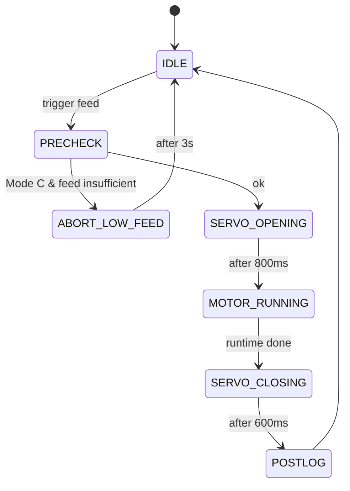
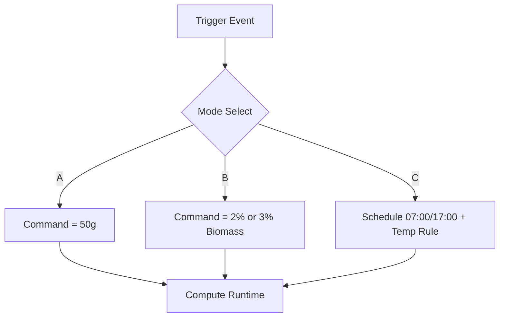

# Feederasea (ESP32 + Blynk + PlatformIO)

Project ini adalah firmware feeder otomatis berbasis ESP32 DevKit (38‑pin) dengan Blynk IoT, sensor suhu DS18B20, sensor jarak HC‑SR04, motor penggerak pakan (BTS7960), servo valve, dan LCD I2C 16x2.

Dokumen ini menjelaskan cara kerja, konfigurasi, mode operasi, dan alur logika lengkap beserta diagram (Mermaid).

---

## 1) Ringkasan Fitur

- Blynk IoT (template `Feederasea`) untuk kontrol & telemetry.
- DS18B20 membaca suhu air (real).
- HC‑SR04 membaca jarak pakan di hopper, dikonversi ke massa pakan (g).
- Servo MG996R membuka/menutup katup pakan.
- Motor BTS7960 menggerakkan pakan sesuai durasi terhitung.
- LCD I2C 16x2 menampilkan mode, suhu real, jarak, dan estimasi pakan.
- State machine non‑blocking untuk dispensing.
- Mode A/B/C sesuai suhu/biomassa/jadwal.

---

## 2) Struktur Project (PlatformIO)

```
Feederasea/
├─ platformio.ini
├─ include/
│  └─ secrets.h
├─ src/
│  └─ main.cpp
└─ README.md
```

---

## 3) Konfigurasi Blynk

**Template:** `Feederasea`

**Auth Token:** sesuai di `include/secrets.h`.

### Datastream (Input dari App)
- V1  `Sim_Temp` (Double, °C)
- V2  `Biomass` (Double, g)
- V3  `Manual_Feed` (Integer, 0/1)
- V4  `Mode_Select` (Integer, 0..2)
- V5  `PWM_Percent` (Integer, 0..100)
- V6  `GramPerSec_100` (Integer, 0..20)
- V7  `Sim_Event` (Integer, 0/1)
- V8  `Test_In` (Integer/Double) -> dipakai sebagai **simulated distance (cm)**

> Catatan: Pastikan datastream V1..V8 **writeable** (Input atau Input/Output) agar ESP32 menerima perubahan dari app.

### Telemetry (Output ke App)
- V20 `TempC` (nilai suhu real dari DS18B20)
- V21 `Feed_Remaining` (massa pakan tersisa)
- V22 `Biomass_Out`
- V23 `Last_Cmd_Grams`
- V24 `Last_PWM`
- V25 `Last_Event`

---

## 4) Hardware & Pin Mapping

### Sensor & Aktuator
- DS18B20: GPIO4
- HC‑SR04: TRIG GPIO12, ECHO GPIO14 (ECHO **harus level‑shift** ke 3.3V)
- Servo MG996R: GPIO26
- BTS7960:
  - L_PWM = GPIO32
  - R_PWM = GPIO33
  - L_EN  = GPIO34 (input‑only ESP32, **tidak bisa output**)
  - R_EN  = GPIO35 (input‑only ESP32, **tidak bisa output**)

> Rekomendasi: pindahkan L_EN/R_EN ke pin output lain **atau** ikat L_EN/R_EN ke 3.3V agar selalu enable.

### LCD I2C
- SDA = GPIO21
- SCL = GPIO22
- Address default = 0x27

### LED & Tombol
- Status LED = GPIO2
- LOW_FEED LED = GPIO15
- Manual Button = GPIO39 (input‑only, aktif LOW, perlu pull‑up eksternal)

---

## 5) Cara Kerja Utama

Firmware berjalan dengan loop non‑blocking menggunakan `Blynk.run()` dan `BlynkTimer`.

### Sampling (tiap 2 detik)
1. Baca DS18B20 (suhu real).
2. Baca jarak HC‑SR04 (atau gunakan nilai V8 jika mode simulasi jarak aktif).
3. Konversi jarak → massa pakan (model silinder).
4. Update LCD & kirim telemetry ke Blynk.

### Estimasi Massa (Hopper Silinder)
- `heightFilled = H_total_cm - distance_cm`
- `volume = pi * radius_cm^2 * heightFilled`
- `mass = volume * bulk_density`

Parameter dapat dikalibrasi di `main.cpp`:
- `H_TOTAL_CM`
- `RADIUS_CM`
- `BULK_DENSITY_G_PER_CM3`

---

## 6) Mode Operasi (Mode A/B/C)

### Mode A (0)
- Komando pakan tetap: **50 g** per event.

### Mode B (1)
- Komando pakan berdasarkan suhu:
  - 25–37°C → 3% dari `Biomass`
  - selain itu → 2% dari `Biomass`

### Mode C (2)
- Schedule feeding pada **07:00** dan **17:00** (WITA, NTP).
- Rumus komando sama dengan Mode B.
- Ada guard agar tidak double‑trigger dalam hari yang sama.
- Jika `Feed_Remaining < Commanded + 1g` → abort, LED LOW_FEED menyala, log event `low_feed`.

---

## 7) State Machine Feeding

Urutan state:

- `IDLE`
- `PRECHECK`
- `SERVO_OPENING`
- `MOTOR_RUNNING`
- `SERVO_CLOSING`
- `POSTLOG`
- `ABORT_LOW_FEED`

Waktu utama:
- Servo open settle: 800 ms
- Servo close settle: 600 ms
- Motor runtime: dihitung dari grams/second (dibatasi max 12 s)

### Rumus Runtime
```
GramsPerSec = GramPerSecAt100pct * (PWM_Percent / 100.0)
Runtime_s = Commanded_grams / GramsPerSec
Clamp runtime max 12s
```

---

## 8) LCD Behavior

- Line1: `M:<mode> R:<real_temp>`
- Line2 (IDLE): `D:<dist> F:<feed>`
- Line2 (Feeding): `Feeding...`
- Line2 (Abort): `LOW FEED!`

LCD tidak di‑refresh terus menerus, hanya saat konten berubah.

---

## 9) Virtual Pin V8 (Simulated Distance)

- V8 digunakan untuk input **jarak simulasi (cm)**.
- Ketika V8 menerima nilai, firmware memakai jarak simulasi untuk estimasi feed, sehingga memudahkan pengujian tanpa HC‑SR04.

---

## 10) Diagram Alur (Mermaid)

### 10.1. Flow Sampling & Telemetry
```mermaid
flowchart TD
  A[Timer 2s] --> B[Read DS18B20]
  B --> C[Read HC-SR04]
  C --> D[Apply sim distance? (V8)]
  D --> E[Compute Feed Mass]
  E --> F[Update LCD]
  F --> G[Send Telemetry to Blynk]
```

### 10.2. Feeding State Machine


### 10.3. Mode Selection Logic


---

## 11) Troubleshooting Ringkas

### 11.1 Blynk Input Tidak Masuk
- Pastikan Datastream V1..V8 **writeable** di Template.
- Pastikan device yang dipakai sesuai Auth Token.
- Cek log serial: `Blynk Vx ...` harus muncul saat kamu ubah nilai di app.

### 11.2 Feed Remaining Selalu 0
- Pastikan HC‑SR04 membaca jarak (cek `Dist` di serial).
- Set `H_TOTAL_CM` sesuai jarak kosong.
- Pastikan echo sudah level‑shift ke 3.3V dan sensor diberi 5V.

### 11.3 Suhu Real `nan`
- DS18B20 belum terbaca, cek wiring dan resistor pull‑up 4.7k ke 3.3V.

---

## 12) Build & Upload (PlatformIO)

```
platformio run
platformio run -t upload
platformio device monitor -p /dev/ttyUSB0 -b 115200
```

---

## 13) Catatan Safety

- Jangan menyalakan motor tanpa beban terlalu lama.
- Pastikan ground semua modul disatukan.
- HC‑SR04 sebaiknya diberi 5V dan echo di‑level‑shift ke 3.3V.

