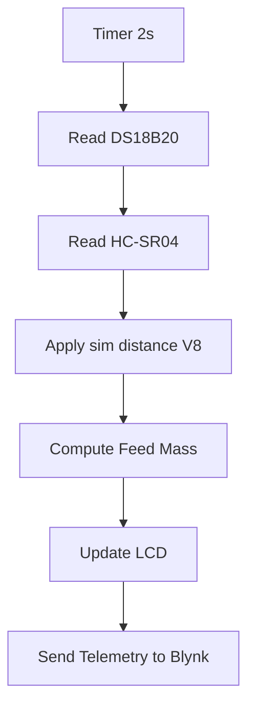
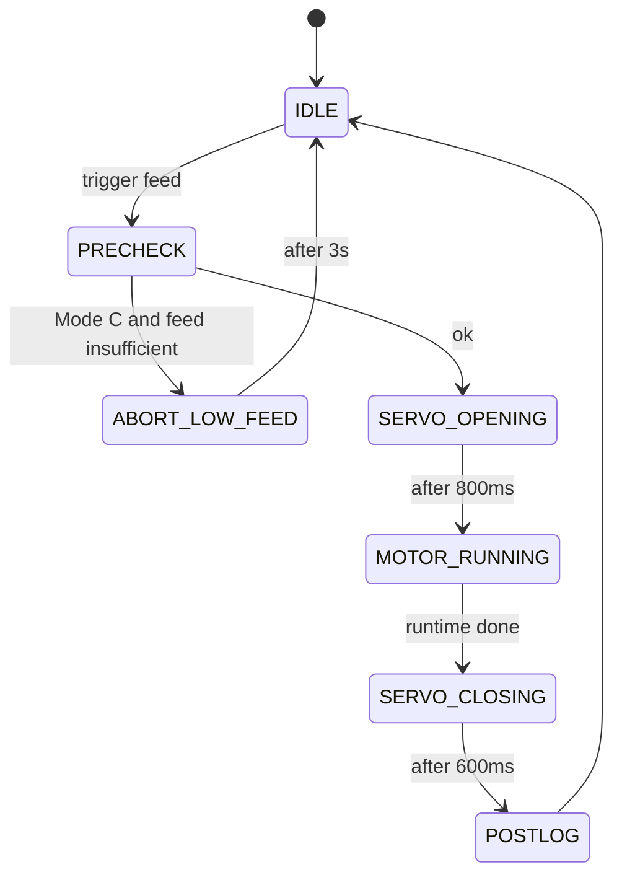

# Feederasea (ESP32 + Blynk + PlatformIO)

Firmware feeder otomatis berbasis ESP32 dengan Blynk IoT, sensor suhu DS18B20, sensor jarak HC-SR04, motor BTS7960, servo katup, dan LCD I2C 16x2.

Dokumen ini menjelaskan konfigurasi, pin mapping, cara kerja, mode operasi, dan tutorial penggunaan.

---

## 1) Ringkasan Fitur

- Blynk IoT untuk kontrol dan telemetry.
- DS18B20 membaca suhu air.
- HC-SR04 membaca jarak pakan di hopper, dikonversi ke massa pakan (g).
- Servo MG996R membuka dan menutup katup pakan.
- Motor BTS7960 menggerakkan pakan sesuai durasi terhitung.
- LCD I2C 16x2 menampilkan mode, suhu, jarak, dan estimasi pakan.
- State machine non-blocking untuk dispensing.
- Mode A/B/C sesuai suhu, biomassa, dan jadwal.

---

## 2) Struktur Project (PlatformIO)

```
Feederasea/
|-- platformio.ini
|-- include/
|   |-- secrets.h
|-- src/
|   |-- main.cpp
|-- README.md
```

---

## 3) Daftar Komponen Lengkap

- ESP32 DevKit (ESP32-WROOM-32)
- Sensor suhu DS18B20 + resistor 4.7k pull-up
- Sensor jarak HC-SR04 + level shifter (atau divider) untuk ECHO 3.3V
- Driver motor BTS7960
- Motor DC + piringan pelontar pakan
- Servo MG996R
- LCD I2C 16x2 (alamat umum 0x27)
- Push button manual + resistor pull-up eksternal
- LED status + resistor, LED low feed + resistor
- Power supply 12V (motor) dan 5V (ESP32, servo, sensor, LCD)
- Step-down 12V ke 5V (contoh LM2596)
- Kabel, terminal, dan konektor

---

## 4) Wiring Diagram (Text)

### Power
- 12V: masuk ke BTS7960 untuk motor
- 5V: ESP32, servo, DS18B20, HC-SR04, LCD
- Semua GND disatukan (common ground)

### DS18B20
- VCC -> 3.3V
- GND -> GND
- DATA -> GPIO4 + resistor 4.7k ke 3.3V

### HC-SR04
- VCC -> 5V
- GND -> GND
- TRIG -> GPIO12
- ECHO -> level-shift -> GPIO14

### BTS7960
- VCC -> 5V (logic)
- GND -> GND
- L_EN -> GPIO27
- R_EN -> GPIO25
- LPWM -> GPIO32
- RPWM -> GPIO33
- MOTOR+/- -> output driver ke motor DC

### Servo MG996R
- VCC -> 5V (supply terpisah lebih baik)
- GND -> GND
- SIG -> GPIO26

### LCD I2C
- VCC -> 5V
- GND -> GND
- SDA -> GPIO21
- SCL -> GPIO22

### LED dan Tombol
- LED Status: GPIO2 -> resistor -> GND
- LED Low Feed: GPIO15 -> resistor -> GND
- Tombol manual: satu kaki ke GND, satu kaki ke GPIO34 + pull-up eksternal ke 3.3V

---

## 5) List GPIO

- GPIO2  : LED status
- GPIO4  : DS18B20 data
- GPIO12 : HC-SR04 TRIG
- GPIO14 : HC-SR04 ECHO (level-shift)
- GPIO15 : LED low feed
- GPIO21 : I2C SDA (LCD)
- GPIO22 : I2C SCL (LCD)
- GPIO25 : BTS7960 R_EN
- GPIO26 : Servo MG996R signal
- GPIO27 : BTS7960 L_EN
- GPIO32 : BTS7960 LPWM
- GPIO33 : BTS7960 RPWM
- GPIO34 : Manual button (input-only)

---

## 6) Konfigurasi Blynk

Template: `Feederasea`
Auth Token: lihat `include/secrets.h`.

### Datastream (Input dari App)
- V1  `Sim_Temp` (Double, C)
- V2  `Biomass` (Double, g)
- V3  `Manual_Feed` (Integer, 0/1)
- V4  `Mode_Select` (Integer, 0..2)
- V5  `PWM_Percent` (Integer, 0..100)
- V6  `GramPerSec_100` (Integer, 1..20)
- V7  `Sim_Event` (Integer, 0/1)
- V8  `Test_In` (Double, cm) -> simulated distance

Pastikan datastream V1..V8 writeable (Input atau Input/Output) agar ESP32 menerima perubahan dari app.

### Telemetry (Output ke App)
- V20 `TempC` (suhu real dari DS18B20)
- V21 `Feed_Remaining` (massa pakan tersisa)
- V22 `Biomass_Out`
- V23 `Last_Cmd_Grams`
- V24 `Last_PWM`
- V25 `Last_Event`

---

## 7) Cara Kerja Utama

Firmware berjalan dengan loop non-blocking menggunakan `Blynk.run()` dan `BlynkTimer`.

### Sampling (tiap 2 detik)
1. Baca DS18B20 (suhu real).
2. Baca jarak HC-SR04 (atau gunakan nilai V8 jika simulasi jarak aktif).
3. Konversi jarak ke massa pakan (model silinder).
4. Update LCD dan kirim telemetry ke Blynk.

### Estimasi Massa (Hopper Silinder)
- `heightFilled = H_TOTAL_CM - distance_cm`
- `volume = pi * radius_cm^2 * heightFilled`
- `mass = volume * bulk_density`

Parameter dapat dikalibrasi di `src/main.cpp`:
- `H_TOTAL_CM`
- `RADIUS_CM`
- `BULK_DENSITY_G_PER_CM3`

---

## 8) Mode Operasi (A/B/C)

### Mode A (0)
- Komando pakan tetap: 50 g per event.

### Mode B (1)
- Komando pakan berdasarkan suhu:
  - 25 C sampai 37 C: 3% dari `Biomass`
  - di luar rentang: 2% dari `Biomass`

### Mode C (2)
- Jadwal feeding pada 07:00 dan 17:00 (WITA, NTP).
- Rumus komando sama dengan Mode B.
- Guard agar tidak double trigger dalam hari yang sama.
- Jika `Feed_Remaining < Commanded + 1g` maka abort, LED LOW_FEED menyala, log event `low_feed`.

---

## 9) State Machine Feeding

Urutan state:
- `IDLE`
- `PRECHECK`
- `SERVO_OPENING`
- `MOTOR_RUNNING`
- `SERVO_CLOSING`
- `POSTLOG`
- `ABORT_LOW_FEED`

Waktu utama:
- Servo open settle: 800 ms
- Servo close settle: 600 ms
- Motor runtime: dihitung dari grams per second (dibatasi max 12 s)

Rumus runtime:
```
GramsPerSec = GramPerSecAt100pct * (PWM_Percent / 100.0)
Runtime_s = Commanded_grams / GramsPerSec
Clamp runtime max 12s
```

---

## 10) Tutorial Penggunaan

### Langkah 1: Wiring
- Sambungkan komponen sesuai pin mapping di atas.
- Pastikan semua GND tersambung menjadi satu.
- ECHO HC-SR04 harus level-shift ke 3.3V.

### Langkah 2: Setup WiFi dan Blynk
- Buka `include/secrets.h`.
- Isi `BLYNK_AUTH_TOKEN`, `WIFI_SSID`, dan `WIFI_PASS`.

### Langkah 3: Build dan Upload
```
platformio run
platformio run -t upload
platformio device monitor -b 115200
```

### Langkah 4: Konfigurasi Blynk App
- Buat datastream V1..V8 dan V20..V25 sesuai list di atas.
- Pastikan V1..V8 writeable.
- Atur widget slider atau input sesuai kebutuhan.

### Langkah 5: Operasi Harian
- Pilih mode dengan V4 (0, 1, 2).
- Atur `Biomass` di V2.
- Atur `PWM_Percent` di V5 dan `GramPerSec_100` di V6 untuk kalibrasi laju.
- Tekan `Manual_Feed` (V3) untuk feed manual.
- Tekan `Sim_Event` (V7) untuk simulasi event.

### Langkah 6: Simulasi Sensor
- V1 `Sim_Temp` untuk simulasi suhu.
- V8 `Test_In` untuk simulasi jarak pakan (cm).

---

## 11) Troubleshooting Ringkas

### 9.1 Blynk Input Tidak Masuk
- Pastikan V1..V8 writeable.
- Pastikan device menggunakan auth token yang benar.
- Cek Serial log: `Blynk Vx ...` harus muncul saat nilai diubah.

### 9.2 Feed Remaining Selalu 0
- Pastikan HC-SR04 membaca jarak (cek `Dist` di serial).
- Set `H_TOTAL_CM` sesuai jarak kosong.
- Pastikan echo level-shift dan sensor diberi 5V.

### 9.3 Suhu Real NaN
- DS18B20 belum terbaca, cek wiring dan resistor pull-up 4.7k ke 3.3V.

---

## 12) Diagram Alur (Mermaid)

### 10.1 Flow Sampling dan Telemetry


### 10.2 Feeding State Machine


### 10.3 Mode Selection Logic


---

## 13) Catatan Safety

- Jangan menyalakan motor tanpa beban terlalu lama.
- Pastikan ground semua modul disatukan.
- HC-SR04 sebaiknya diberi 5V dan echo di level-shift ke 3.3V.
