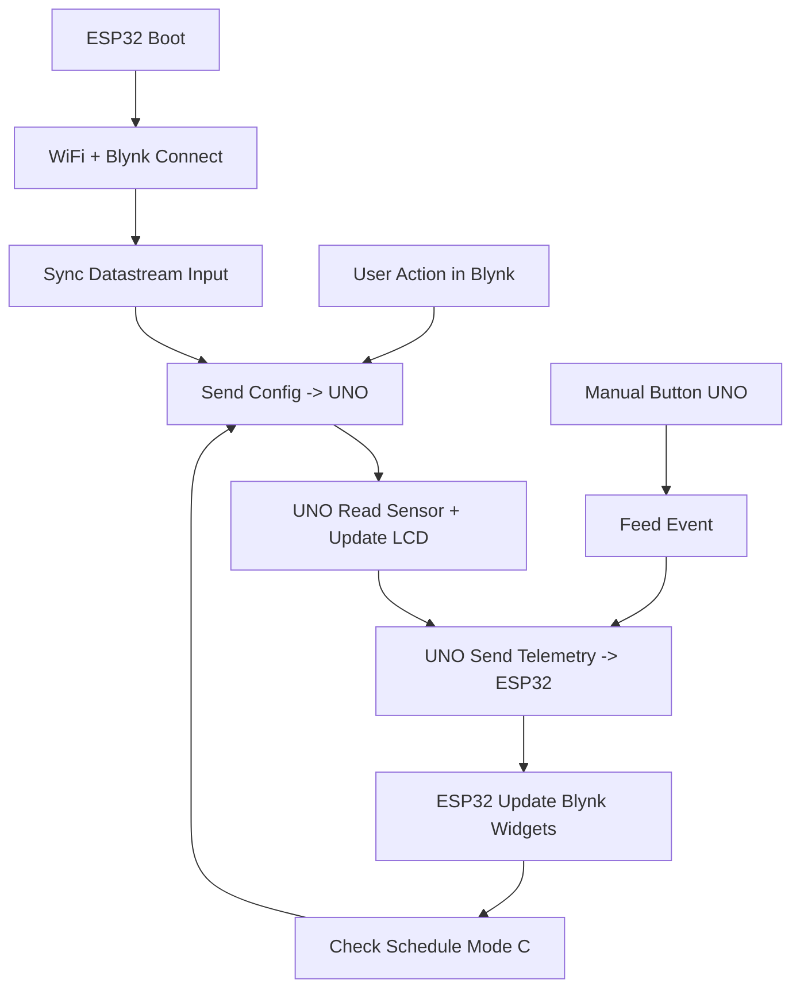

# Feederasea (ESP32 + Arduino UNO)

Project ini adalah feeder otomatis berbasis IoT. ESP32 menangani WiFi/Blynk, jadwal, dan komunikasi UART. Arduino UNO menangani sensor, perhitungan massa pakan, motor/servo, dan LCD.

---

## 1) Struktur Folder

```
Feederasea/
+- Feederasea-R3Wifi-ESP32/   # Firmware ESP32 (Blynk + WiFi + schedule + UART)
+- Feederasea-R3Wifi-UNO/     # Firmware UNO (sensor + aktuator + LCD)
```

---

## 2) Komponen Utama

- ESP32 DevKit 38-pin
- Arduino UNO R3
- DS18B20 + resistor 4.7k (pull-up)
- HC-SR04 (TRIG/ECHO, ECHO perlu level shift ke 3.3V)
- Driver motor BTS7960 + motor DC
- Servo (contoh MG996R)
- LCD I2C 16x2 (alamat umum 0x27)
- Tombol manual, LED status, LED low feed
- Power 12V (motor) + 5V (board/sensor), step-down 12V->5V

---

## 3) Wiring Ringkas

### UART ESP32 <-> UNO
- UNO D0 (RX)  <- ESP32 TX0 (GPIO1)
- UNO D1 (TX)  -> ESP32 RX0 (GPIO3) **wajib level shift 5V -> 3.3V**
- GND harus common

### Sensor/Actuator di UNO (lihat detail di `Feederasea-R3Wifi-UNO/README.md`)
- DS18B20 -> D4
- HC-SR04 TRIG -> D12, ECHO -> D11 (level shift)
- Servo -> D9
- BTS7960: LPWM D5, RPWM D6, L_EN D7, R_EN D8
- LCD I2C -> A4/A5
- Button -> D2 (INPUT_PULLUP)
- LED status D13, LED low feed D10

---

## 4) Setup dan Upload (PlatformIO)

### ESP32
1. Buka folder `Feederasea-R3Wifi-ESP32`.
2. Isi WiFi dan token di `Feederasea-R3Wifi-ESP32/include/secrets.h`.
3. Build & upload:
```
platformio run
platformio run -t upload
platformio device monitor -b 9600
```

### UNO
1. Buka folder `Feederasea-R3Wifi-UNO`.
2. Build & upload:
```
platformio run
platformio run -t upload
platformio device monitor -b 9600
```

Catatan: Saat upload ESP32, lepaskan UART ke UNO agar tidak mengganggu flashing.

---

## 5) Blynk Datastream

### Input (dari app)
- V1  `Sim_Temp` (C)
- V2  `Biomass` (g)
- V3  `Manual_Feed` (0/1)
- V4  `Mode_Select` (0..2)
- V5  `PWM_Percent` (0..100)
- V6  `GramPerSec_100` (1..20)
- V7  `Sim_Event` (0/1)
- V8  `Test_In` (cm)

### Output (ke app)
- V20 `TempC`
- V21 `Feed_Remaining`
- V22 `Biomass_Out`
- V23 `Last_Cmd_Grams`
- V24 `Last_PWM`
- V25 `Last_Event` (log status, cocok untuk Widget Terminal)

---

## 6) Mode Operasi

- Mode A (0): komando pakan tetap 50g.
- Mode B (1): 25-37C = 3% biomassa, di luar = 2%.
- Mode C (2): jadwal otomatis jam 07:00 dan 17:00 (WITA), rumus sama dengan Mode B.

---

## 7) Flow Diagram (Mermaid)



---

## 8) Panduan Penggunaan (User Guide)

### A) Mode Feeding
- **Mode A (0)**: Pakan tetap 50g per event.
- **Mode B (1)**: Pakan berdasarkan suhu (25-37C = 3% biomassa, di luar = 2%).
- **Mode C (2)**: Sama dengan Mode B, tetapi otomatis pada 07:00 dan 17:00 (WITA).

### B) Interface Kontrol (Blynk Input)
- **V3 Manual_Feed**: Tombol manual untuk men-trigger pakan.
- **V4 Mode_Select**: Pilih mode A/B/C (0/1/2).
- **V5 PWM_Percent**: Kecepatan motor (%).
- **V6 GramPerSec_100**: Kalibrasi laju pakan pada PWM 100%.
- **V2 Biomass**: Total biomassa ikan (gram), dipakai di Mode B/C.
- **V7 Sim_Event**: Aktifkan simulasi dan trigger event simulasi.
- **V1 Sim_Temp** dan **V8 Test_In**: Input simulasi suhu dan jarak (aktif saat V7=1).

### C) Interface Monitoring (Blynk Output)
- **V20 TempC**: Suhu efektif (real/simulasi).
- **V21 Feed_Remaining**: Estimasi sisa pakan di hopper.
- **V22 Biomass_Out**: Biomassa saat ini (echo dari input).
- **V23 Last_Cmd_Grams**: Gram perintah terakhir.
- **V24 Last_PWM**: PWM terakhir yang dipakai.
- **V25 Last_Event**: Log status ringkas (disarankan widget Terminal).

### D) Alur Operasi Singkat
1. Nyalakan alat, ESP32 connect WiFi dan Blynk.
2. Atur biomassa (V2), mode (V4), dan kalibrasi (V6, V5).
3. Untuk manual feed, tekan V3.
4. Untuk mode jadwal, pilih Mode C dan biarkan sistem otomatis.
5. Pantau V20-V25 untuk status dan hasil event.

---

## 9) Protokol Serial (ESP32 <-> UNO)

ESP32 -> UNO:
- `SET:MODE=0|1|2`
- `SET:BIOMASS=xxxx`
- `SET:PWM=0..100`
- `SET:GPS100=1..20`
- `SET:SIM_MODE=0|1`
- `SET:SIM_TEMP=xx.xx`
- `SET:SIM_DIST=xx.xx`
- `CMD:MANUAL`
- `CMD:SIM_EVT`
- `CMD:SCHED_07`
- `CMD:SCHED_17`

UNO -> ESP32:
```
TELEM,T=xx.xx,TR=yy.yy,DIST=zz.z,FEED=nnn,MODE=m,STATE=s,EVENT=LABEL,BIOMASS=bbbb,CMD=ccc,PWM=pp,SIM=0|1
```

---

## 10) Troubleshooting

- Blynk nilai 0: cek UART UNO<->ESP32 (RX/TX, GND, level shift), baud 9600.
- `STALE` di V25: telemetry dari UNO tidak masuk atau terputus.
- LCD stuck "Feeding...": cek tombol manual (gunakan INPUT_PULLUP).
- Motor tidak jalan: cek supply 12V dan wiring BTS7960.

---

## 11) Catatan Keamanan

- Jangan commit `include/secrets.h` ke repo publik jika berisi token/SSID asli.
- Gunakan level shifting untuk sinyal 5V -> 3.3V (UNO TX dan HC-SR04 ECHO).
- Jangan menyalakan motor tanpa beban terlalu lama.
- Pastikan semua ground tersambung (common ground).

